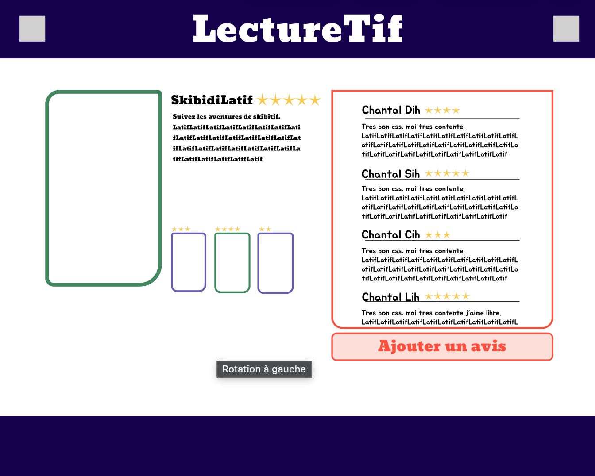
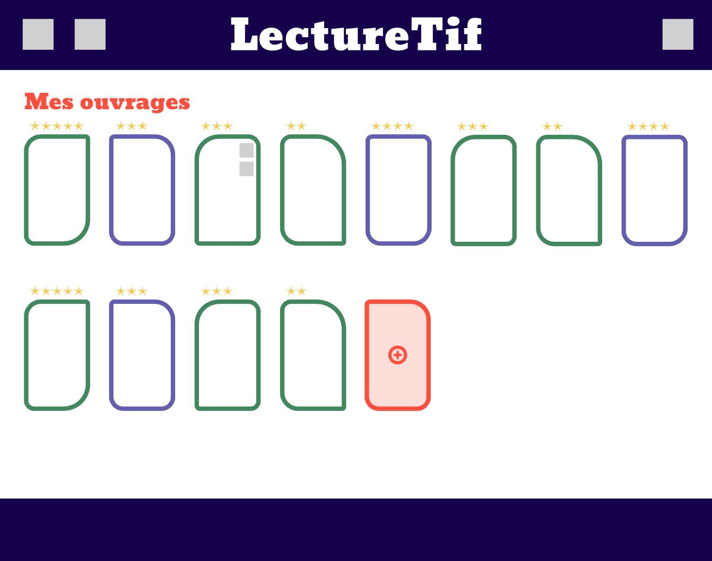
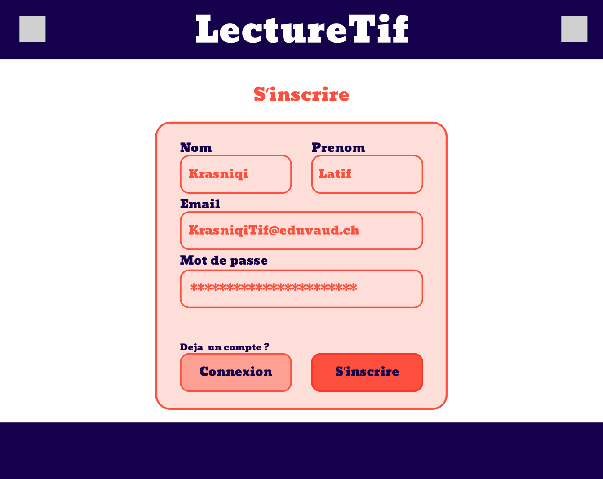
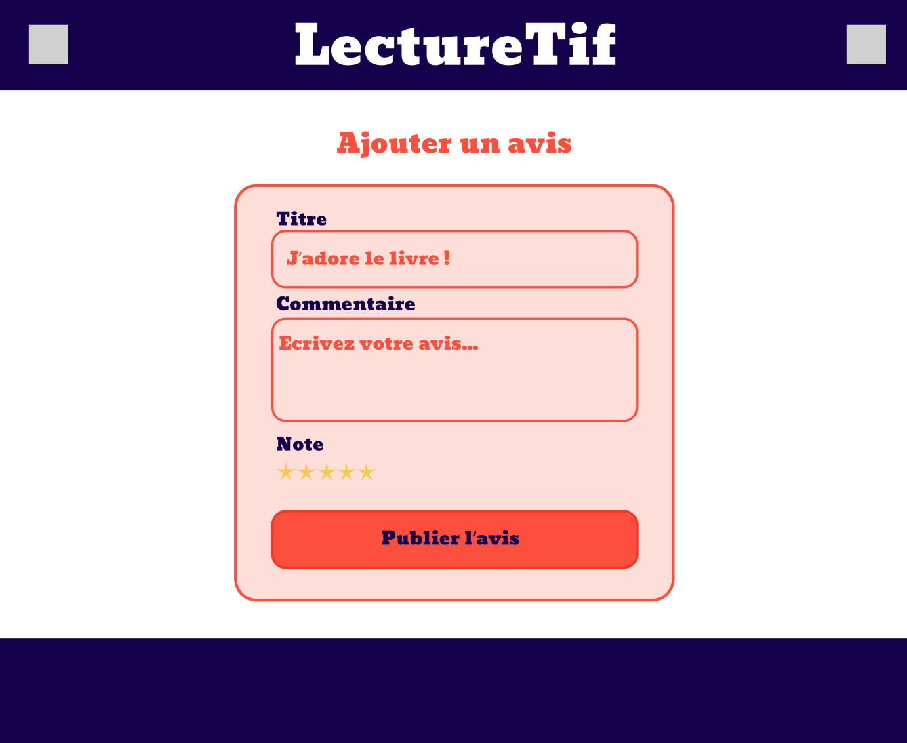

<div align="center">
    <h1>PassionLecture_294<h1/>
    
    <br>
    <br>
    <br>
</div>

<div align="center">
    Auteurs : Latif KRASNIQI, David SOTTAS<br>
    ETML - Vennes<br>
    Durée du projet : 32p<br>
    Chef de projet : Grégory CHARMIER
</div><br><br>

## Table des Matières
1. [Introduction](#introduction)
2. [Analyse](#analyse)
3. [Reéalisation](#réalisation)
4. [Conclusion](#conclusion)

## Introduction

Nous avons fais un site qui s'intitule : Passion Lecture. C'est un site qui permet de poster des ouvrages de tout type pour que les gens puissent les noter et mettre des commentaires. il est possible d'ajouter un ouvrage, le modifier et le supprimer. Le site est codé en Vue.js avec une simulation de backend en utilisant json-server.

## Analyse

### Maquettes


<br>

Notre page d'accueil contenant un titre et  les 5 derniers ouvrages (cliquables). les ouvrages ont un titre une petite descripition et une note.


<br>

Cette page s'affiche quand on clique sur un livre. il y la note, les informations sur le livre, les avis et un bouton pour ajouter un avis.


<br>

Une page avec un formulaire pour modifier les informations d'un livre. Il y a une page similaire pour ajouter des livres.


<br>

Une page avec tout les livres trié par catégories.


<br>

Une page pour voir les livre posté par sois même.


<br>

Une page pour ce connecter.


<br>

Une page pour créer un compte.


<br>

un formulaire pour ajouter un avis sur un livre.

### Planification des tâches

Nous avons écris pleins de tâches au tout debut du projet et les avons assigné au fur et à mesure que le projet avançait. Nous avons biensur ajouté de nouvelles tâches au cours du projet.


### Structure du code

Nous avons repris la structure de base en ajoutant de nouveaux fichiers `.vue` dans le dossier : `PassionLecture/src/views` afin d’avoir un nombre de pages en corrélation avec nos maquettes.  

Nous avons deux services présents dans le dossier : `PassionLecture/src/services`.  
Un service sert à faire les requêtes HTTP pour les livres et l’autre pour les avis.  

Nous avons deux composants présents dans le dossier : `PassionLecture/src/components`, qui sont le header et le footer, car ils sont présents sur toutes les pages.  

Nous avons des routes présentes dans le dossier : `PassionLecture/src/router` qui permettent de rediriger les utilisateurs vers les différents composants, en mettant par exemple sur un bouton :

```html
<router-link :to="{ name: 'composant' }">(Code du bouton HTML)</router-link>
```

### Analyse des routes

| **Nom** | **Verbe HTTP** | **URL** | **Envoyer du JSON** |
| :--- | :--- | :--- | :--- |
| **Récuperer tout les livres** | ```GET``` | ```/api/books``` | ```NON``` |
| **Modifier un livre** | ```PUT``` | ```/api/books/:id``` | ```OUI``` |
| **Ajouter un livre** | ```POST``` | ```/api/books``` | ```OUI``` |
| **Supprimer un livre** | ```DELETE``` | ```/api/books/:id``` | ```NON``` |
| **Voir les details d'un livre** | ```GET``` | ```/api/books/:id``` | ```NON``` |
| **Ajouter un avis** | ```POST``` | ```/api/books/:id/reviews``` | ```OUI``` |
| **Modifier un avis** | ```PUT``` | ```/api/books/:id/reviews``` | ```OUI``` |
| **Ajouter un auteur** | ```POST``` | ```/api/authors``` | ```OUI``` |
| **Voir les auteurs** | ```GET``` | ```/api/authors``` | ```NON``` |
| **Supprimer un auteur** | ```DELETE``` | ```/api/authors/:id``` | ```NON``` |

## Réalisation

### Fonctionnalités

Pour afficher les livres sur la page d'accueil, nous faisons appel à un service qui effectue une requête `GET` sur tous les livres, puis nous utilisons un `v-if` dans la partie HTML pour afficher les 5 derniers.

Pour afficher tous les livres, nous faisons simplement appel au même service qu'auparavant.

Pour ajouter un livre, nous faisons appel à un service qui effectue une requête `POST`. Ensuite, nous faisons des liaisons bidirectionnelles avec des `v-model` sur le formulaire.

Pour modifier un livre, nous faisons d'abord appel à un service qui effectue une requête `GET` afin de récupérer les informations du livre. Ensuite, nous appelons un service qui effectue une requête `PUT`. Comme précédemment, nous utilisons des liaisons bidirectionnelles avec des `v-model` sur le formulaire.

Pour supprimer un livre, il y a un bouton "Supprimer" qui appelle une fonction ouvrant une fenêtre de confirmation et récupérant l'ID du livre. Ensuite, le bouton "Supprimer" dans la fenêtre de confirmation appelle une fonction qui utilise un service effectuant une requête `DELETE`.

Pour afficher les détails d'un livre, nous faisons appel à un service qui effectue une requête `GET` avec l'ID du livre en paramètre afin d'afficher les informations correspondantes. Dans cette page de détails, nous affichons également les avis en utilisant un service qui effectue une requête `GET`.

La logique pour la gestion des avis est similaire à celle des livres : nous utilisons différents services qui effectuent des requêtes HTTP (`GET`, `POST`, `PUT` et `DELETE`) afin de récupérer, ajouter, modifier ou supprimer des avis.

### Git

Pour optimiser notre organisation sur Git, nous nous coordonnons d'abord sur la répartition des tâches. Chacun travaille ensuite sur sa propre branche afin d'éviter tout conflit lors des commits intermédiaires.

Lorsqu'un de nous termine sa tâche, il ouvre une Pull Request pour merge son code (le premier merge se fait normalement sans problème). En revanche, lorsque l'autre termine, des conflits peuvent apparaître : dans ce cas, nous effectuons une revue à deux pour analyser et résoudre les conflits ensemble avant de valider le merge.

## Conclusion

### Conclusion générale

Nous nous sommes plutôt bien débrouillés avec le framework Vue.js et l’API Composition. Malgré quelques erreurs complexes à résoudre, nous avons tout de même réussi à proposer une solution satisfaisante.

### Conclusion personnelle

#### Conclusion de Latif

J’ai bien aimé participer à ce projet et travailler avec le framework Vue.js. Cependant, cela m’a un peu dérangé de devoir simuler un backend avec json-server, car je pensais au départ faire uniquement du frontend durant ce projet. En effet, Vue.js semble au premier abord être un framework entièrement orienté frontend. Malgré cela, je pense m’en être globalement assez bien sorti.

#### Conclusion de David

J'ai apprécié le fait que le développement du projet soit principalement lié à VueJS et non à l’HTML et au CSS, grâce à l’IA. Une critique que je pourrais formuler concerne le fait que le projet AdonisJS ait été réalisé en même temps que celui-ci. Les deux frameworks se ressemblant, il était parfois confus de passer de l’un à l’autre. Les autres parties du projet, comme par exemple les maquettes ou le rapport, ne sont pas forcément toujours un plaisir à réaliser. J’ai tout de même eu beaucoup de plaisir à effectuer ce projet et les exercices réalisés en classe étaient très utiles.

### Critique de la planification

Nos tâches n'étaient pas assez précises. Nous aurions pu détailler davantage leur description dans GitHub Projects et les diviser en éléments plus petits afin de mieux structurer le travail.
