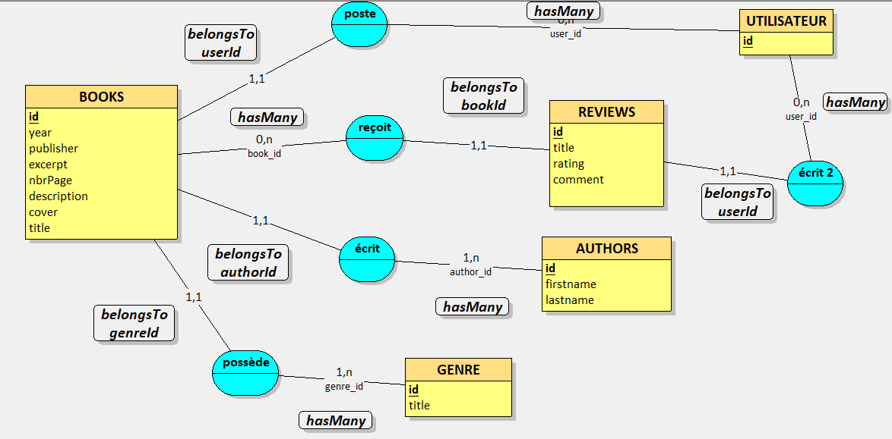
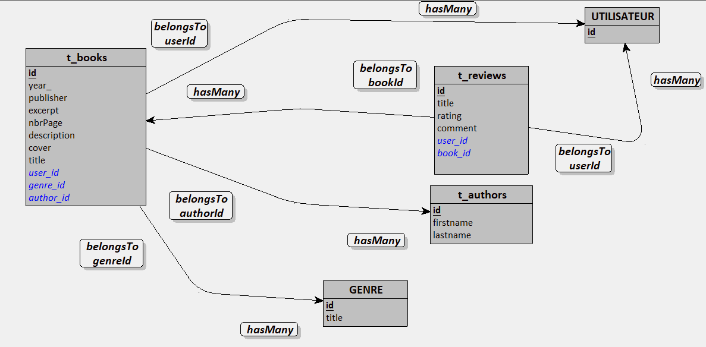

    <h1>PassionLecture_295<h1/>
    
     
     
     

    Auteurs : Latif KRASNIQI, David SOTTAS 
    ETML - Vennes 
    Durée du projet : 32p 
    Chef de projet : Grégory CHARMIER

  

## Table des matières

1. [Introduction](#introduction)
2. [Analyse](#analyse)
   - [Planification des tâches](#planification-des-tâches)
   - [Analyse de l'API REST](#analyse-de-lapi-rest)
   - [Analyse de la base de données](#analyse-de-la-base-de-données)
3. [Réalisation](#réalisation)
   - [Authentification et gestion des rôles](#authentification-et-gestion-des-rôles)
   - [Sécurité](#sécurité)
4. [Tests](#tests)
5. [Conclusion](#conclusion)
   - [Organisation Git / GitHub](#organisation-git--github)
   - [Conclusion générale](#conclusion-générale)
   - [Conclusion personnelle](#conclusion-personnelle)
   - [Critique de la planification](#critique-de-la-planification)

---

## Introduction

PassionLecture est une application web permettant aux utilisateurs de partager, découvrir et commenter des ouvrages littéraires de toutes catégories. Chaque utilisateur peut créer un compte, ajouter des livres avec leur couverture, les associer à un auteur et un genre, puis consulter ou laisser des avis notés sur les ouvrages des autres membres.

Le projet est découpé en deux parties distinctes. Le **frontend** est développé en **Vue.js 3** avec l'API Composition et communique avec le backend via des requêtes HTTP. Le **backend** est développé avec **AdonisJS 6** (TypeScript) et expose une API REST sécurisée. La persistance des données est assurée par une base de données **MySQL**, pilotée par l'ORM Lucid intégré à AdonisJS.

Ce projet fait suite à une première version entièrement frontend utilisant `json-server` pour simuler un backend. L'objectif de cette itération est de remplacer cette simulation par un vrai backend structuré, avec authentification, validation des données et base de données relationnelle.

> **Fonctionnalités manquantes :** La gestion des rôles (distinction admin / utilisateur).

---

## Analyse

### Planification des tâches

La gestion des tâches est réalisée via **GitHub Projects**, ce qui permet au chef de projet de suivre l'évolution en temps réel. Les tâches sont organisées en colonnes (To Do / In Progress / Done) et assignées à chaque membre selon les sprints.

> Lien vers le tableau de bord : [GitHub Projects – PassionLecture](https://github.com/AsDeLaGachette/PassionLecture/projects)

Au démarrage du projet, les grandes tâches ont été définies (mise en place du backend, migrations, contrôleurs, authentification, intégration frontend/backend) et affinées en sous-tâches au fur et à mesure de l'avancement.

---

### Analyse de l'API REST

L'API est préfixée par `/api`. La documentation interactive est accessible via `/docs` (Swagger UI généré automatiquement avec `adonis-autoswagger`).

#### Authentification

| Verbe | URI | Auth requise | Corps JSON |
|:------|:----|:------------:|:-----------|
| `POST` | `/api/user/register` | Non | `{ "email": "...", "password": "...", "fullName": "..." }` |
| `POST` | `/api/user/login` | Non | `{ "email": "...", "password": "..." }` |
| `POST` | `/api/user/logout` | Oui | — |
| `GET` | `/api/me` | Oui | — |

#### Livres

| Verbe | URI | Auth requise | Corps JSON |
|:------|:----|:------------:|:-----------|
| `GET` | `/api/books` | Non | — |
| `GET` | `/api/books/:id` | Non | — |
| `GET` | `/api/books/:id/cover` | Non | — |
| `GET` | `/api/me/books` | Oui | — |
| `POST` | `/api/books` | Oui | `multipart/form-data` : `title`, `year`, `publisher`, `excerpt`, `nbrPage`, `description`, `cover` (fichier), `genreId`, `authorId`, `userId` |
| `PUT` | `/api/books/:id` | Oui | Idem POST |
| `DELETE` | `/api/books/:id` | Oui | — |

#### Avis (Reviews)

| Verbe | URI | Auth requise | Corps JSON |
|:------|:----|:------------:|:-----------|
| `GET` | `/api/books/:book_id/reviews` | Non | — |
| `GET` | `/api/books/:book_id/reviews/:id` | Non | — |
| `POST` | `/api/books/:book_id/reviews` | Oui | `{ "title": "...", "rating": 4, "comment": "..." }` |
| `PUT` | `/api/books/:book_id/reviews/:id` | Oui | `{ "title": "...", "rating": 4, "comment": "..." }` |
| `DELETE` | `/api/books/:book_id/reviews/:id` | Oui | — |

#### Auteurs & Genres

| Verbe | URI | Auth requise | Corps JSON |
|:------|:----|:------------:|:-----------|
| `GET` | `/api/authors` | Non | — |
| `GET` | `/api/authors/:id` | Non | — |
| `POST` | `/api/authors` | Non | `{ "firstname": "...", "lastname": "..." }` |
| `PUT` | `/api/authors/:id` | Non | `{ "firstname": "...", "lastname": "..." }` |
| `DELETE` | `/api/authors/:id` | Non | — |
| `GET` | `/api/genres` | Non | — |

---

### Analyse de la base de données

La base de données est composée de six tables. Voici le détail de chacune :

#### Table `users`

| Colonne | Type | Contraintes |
|:--------|:-----|:------------|
| `id` | INT | PK, auto-increment, NOT NULL |
| `full_name` | VARCHAR | nullable |
| `email` | VARCHAR(254) | NOT NULL, UNIQUE |
| `password` | VARCHAR | NOT NULL |
| `created_at` | TIMESTAMP | NOT NULL |
| `updated_at` | TIMESTAMP | nullable |

#### Table `auth_access_tokens`

Gérée automatiquement par `@adonisjs/auth`. Stocke les tokens OAT actifs liés à chaque utilisateur, permettant leur révocation immédiate lors d'un logout.

#### Table `genres`

| Colonne | Type | Contraintes |
|:--------|:-----|:------------|
| `id` | INT | PK, auto-increment |
| `title` | VARCHAR | — |
| `created_at` | TIMESTAMP | — |
| `updated_at` | TIMESTAMP | — |

#### Table `authors`

| Colonne | Type | Contraintes |
|:--------|:-----|:------------|
| `id` | INT | PK, auto-increment |
| `firstname` | VARCHAR | — |
| `lastname` | VARCHAR | — |
| `created_at` | TIMESTAMP | — |
| `updated_at` | TIMESTAMP | — |

#### Table `books`

| Colonne | Type | Contraintes |
|:--------|:-----|:------------|
| `id` | INT | PK, auto-increment |
| `title` | VARCHAR | — |
| `year` | INT | — |
| `publisher` | VARCHAR | — |
| `excerpt` | VARCHAR | — |
| `nbr_page` | INT | — |
| `description` | VARCHAR | — |
| `cover` | LONGBLOB | image de couverture |
| `genre_id` | INT | FK → `genres.id` ON DELETE CASCADE |
| `author_id` | INT | FK → `authors.id` ON DELETE CASCADE |
| `user_id` | INT | FK → `users.id` ON DELETE CASCADE |
| `created_at` | TIMESTAMP | — |
| `updated_at` | TIMESTAMP | — |

#### Table `reviews`

| Colonne | Type | Contraintes |
|:--------|:-----|:------------|
| `id` | INT | PK, auto-increment |
| `title` | VARCHAR | — |
| `rating` | INT | — |
| `comment` | VARCHAR | — |
| `user_id` | INT | FK → `users.id` ON DELETE CASCADE |
| `book_id` | INT | FK → `books.id` ON DELETE CASCADE |
| `created_at` | TIMESTAMP | — |
| `updated_at` | TIMESTAMP | — |

#### Relations

- Un **genre** peut être associé à plusieurs **livres** (1-N).
- Un **auteur** peut avoir écrit plusieurs **livres** (1-N).
- Un **utilisateur** peut avoir ajouté plusieurs **livres** (0-N).
- Un **livre** peut recevoir plusieurs **avis** (1-N).
- Un **utilisateur** peut rédiger plusieurs **avis** (1-N).

Toutes les clés étrangères sont définies avec `ON DELETE CASCADE`, ce qui garantit l'intégrité référentielle : la suppression d'un enregistrement parent entraîne automatiquement la suppression de tous les enregistrements enfants associés.

#### MCD (Modèle Conceptuel de Données)

    
     

#### MLD (Modèle Logique de Données)

    
     

---

## Réalisation

### Authentification et gestion des rôles

#### Authentification

L'authentification repose sur les **OAT (Opaque Access Tokens)** fournis par le package `@adonisjs/auth`. Lors de la connexion ou de l'inscription, le backend génère un token opaque unique qui est retourné au client. Ce token doit ensuite être transmis dans le header `Authorization: Bearer <token>` pour toutes les requêtes protégées.

**Flux d'inscription (`POST /api/user/register`) :**
1. Les données (`email`, `password`, `fullName`) sont validées par VineJS.
2. L'email est vérifié comme unique en base de données.
3. Le mot de passe est haché automatiquement via le mixin `withAuthFinder` (algorithme Scrypt).
4. Un token OAT est créé et retourné avec les informations de l'utilisateur.

**Flux de connexion (`POST /api/user/login`) :**
1. Les credentials sont validés par VineJS.
2. `User.verifyCredentials(email, password)` vérifie le hash du mot de passe.
3. Un token OAT est créé et retourné au client.

**Flux de déconnexion (`POST /api/user/logout`) :**
1. Le middleware `auth` vérifie le token Bearer.
2. L'identifiant du token courant est récupéré via `auth.user?.currentAccessToken.identifier`.
3. Le token est supprimé de la table `auth_access_tokens` via `User.accessTokens.delete()`.

Les routes protégées (création/modification/suppression de livres et d'avis, logout, `/me`) sont sécurisées via `.use(middleware.auth())` dans le fichier de routes.

#### Gestion des rôles

> **Fonctionnalité non implémentée.** Dans la version actuelle, il n'existe pas de distinction entre un utilisateur standard et un administrateur. Tous les utilisateurs authentifiés ont les mêmes droits d'écriture. De plus, la vérification de propriété sur les avis (empêcher un utilisateur de modifier ou supprimer un avis qui ne lui appartient pas) n'a pas pu être implémentée.

---

### Sécurité

Plusieurs mesures ont été mises en place pour sécuriser l'application :

**Hachage des mots de passe – Scrypt**
Les mots de passe ne sont jamais stockés en clair. AdonisJS utilise l'algorithme **Scrypt** (via le driver `@adonisjs/core/hash`) avec les paramètres : `cost: 16384`, `blockSize: 8`, `parallelization: 1`. Le champ `password` est marqué `serializeAs: null` dans le modèle User, ce qui garantit qu'il n'est jamais inclus dans les réponses JSON.

**Validation des entrées – VineJS**
Toutes les données reçues par l'API sont validées à l'aide de **VineJS** avant d'être traitées :
- Les emails sont normalisés et leur unicité est vérifiée en base.
- Les mots de passe ont une longueur minimale et maximale.
- Les champs numériques (année, nombre de pages, note) ont des bornes définies.
- Les fichiers de couverture sont limités en taille (67 Mo) et en extensions (`jpg`, `jpeg`, `png`, `webp`).
- Les clés étrangères (`genreId`, `authorId`, `userId`) sont vérifiées comme existantes en base avant insertion.

**CORS restreint**
La configuration CORS (`backend/config/cors.ts`) n'autorise les requêtes cross-origin qu'en provenance de `http://localhost:5173` (l'origine du frontend en développement), limitant ainsi les appels depuis des origines non prévues.

**Tokens OAT révocables**
Contrairement aux JWT, les tokens OAT sont stockés en base de données. Ils peuvent être invalidés immédiatement lors d'un logout, sans attendre une expiration. Cela offre un contrôle précis sur les sessions actives.

**Clés étrangères avec CASCADE**
Les contraintes de clés étrangères avec `onDelete('CASCADE')` garantissent l'intégrité référentielle : la suppression d'un utilisateur ou d'un livre entraîne automatiquement la suppression des données associées, évitant tout enregistrement orphelin.

**Middleware `force_json_response`**
Toutes les réponses de l'API retournent du JSON, empêchant la fuite d'informations via des pages d'erreur HTML non maîtrisées.

---

## Conclusion

### Organisation Git / GitHub

Nous avons suivi une organisation basée sur les **branches par fonctionnalité**. Chaque développeur travaille sur sa propre branche nommée d'après son prénom (`latif`, `david`) ou la fonctionnalité concernée. Les Pull Requests sont ouvertes vers `main` une fois la tâche terminée.

Le premier merge d'une PR se fait généralement sans conflit. Lorsque les deux développeurs terminent leurs tâches en parallèle, des conflits peuvent apparaître lors du second merge : ils sont résolus systématiquement en revue à deux, ce qui garantit que personne n'écrase du travail sans validation mutuelle.

GitHub Projects a servi d'outil de suivi, avec des tickets liés aux commits et PR correspondants pour garder une traçabilité claire.

---

### Conclusion générale

Ce projet nous a permis de passer d'une simulation de backend (json-server) à une vraie API REST structurée avec AdonisJS. La mise en place de l'authentification par tokens, de la validation des données et des relations entre modèles nous a donné une vision complète du développement fullstack. Malgré les fonctionnalités manquantes (rôle), l'architecture en place constitue une base solide et extensible.

---

### Conclusion personnelle

#### Conclusion de Latif

Ce projet m'a permis de consolider mes connaissances en développement backend avec AdonisJS et de comprendre concrètement le fonctionnement d'une API REST sécurisée. La mise en place de l'authentification par tokens OAT, du hachage des mots de passe et de la validation des données m'a appris énormément sur les bonnes pratiques de sécurité. J'aurais aimé avoir le temps d'implémenter la gestion des rôles, qui auraient apporté une véritable valeur ajoutée à l'application. Dans l'ensemble, je suis satisfait du travail accompli et de la progression réalisée.

#### Conclusion de David

J'ai apprécié la cohérence entre le projet frontend réalisé précédemment et ce backend, qui donne enfin du sens à toute l'architecture. Travailler avec AdonisJS et TypeScript en parallèle du frontend Vue.js était parfois source de confusion entre les deux environnements, mais cela m'a aussi forcé à mieux distinguer les responsabilités de chaque couche. Les parties moins stimulantes, comme la rédaction du rapport ou la configuration initiale, restent nécessaires et j'ai appris à les appréhender différemment. Ce projet m'a donné une bonne vision du développement fullstack en conditions réelles.

---

### Critique de la planification

Conscients des erreurs de planification soulevées lors du projet précédent, nous avons tenté d'y remédier en découpant davantage nos tâches au démarrage. Cependant, au fil du temps, nous avons progressivement rebasculé vers des tâches trop vastes, répétant ainsi les mêmes travers qu'auparavant. Ce glissement s'est fait de manière naturelle, sans que l'on s'en rende compte sur le moment, ce qui montre que la discipline de découpage doit être maintenue activement tout au long du projet, et pas seulement à son lancement.
